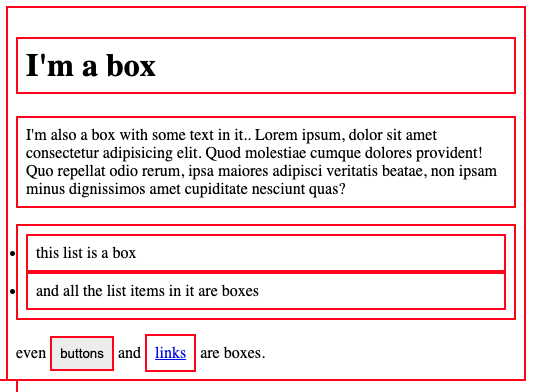

# CSS

## Selektorok

Ha a két bizonyos id-s vagy class-es tagnak ugyanazok a stílusértékeit akkor azokat egy vesszovel elválasztott listába írhatjuk:
```

.read,
.unread{
    color: white;
    background-color: black
}

.read {
    /* Sajátos stílusértékek */
}

.unread {
    /* Sajátos stílusértékek */
}
```
Chainelt selektorok 

```
<div>
  <div class="subsection header">Latest Posts</div>
  <p class="subsection preview">This is where a preview for a post might go.</p>
</div>
```
Ha csak egy olyan subsection class értéket szeretnenk kiválasztani mely tartalmazza a headert akkor azt 2 érték chainelésével tehetjuk meg

```
.section.header {
    color: red
}
```

## Kombinátor

Csak akkor fogja kiválasztani az utolsó elemet ha annak van egy elotte lévo parent eleme. 

HTML
```

<div class="ancestor"> <!-- A -->
  <div class="contents"> <!-- B -->
    <div class="contents"> <!-- C -->
    </div>
  </div>
</div>

<div class="contents"></div> <!-- D -->
```
CSS
```
/* styles.css */

.ancestor .contents {
  /* some declarations */
}
```
Itt a B és a C lesz kiválasztva, 

## CSS alapértékek

    + color és background-color - A szín illetve háttérszín megadása
    + font-family: Betutípus pl. "Times New Roman" vagy "sans-serif"
    + font-size: Betuméret pixelekben pl. 22px
    + font-weight: Lehet szám 1-tol 1000-ig vagy kulcsszó pl. bold 
    + text-align: A szoveg vizszintes pozícionálása kulcsszóval pl. center
    + Image width és height: Kép szélessége, hosszúsága pixelben, százalékban vagy auto értékkel 

## Selectorok priorutási sorrendje

    1. ID selektor
    2. Class selektor - Minél tobb class annál elonyosebb a tobbi classhoz képest, ha konfliktus van.
    3. Típus selektor

## Orokles (Inheritance)

A parent stilusértékei érvényesek a children tagekre kivéve ha a children tageket kulon írjuk. 

```
<!-- index.html -->

<div id="parent">
  <div class="child"></div>
</div>

/* styles.css */

#parent {
  color: red;
}

.child {
  color: blue
}
```

## Box Model

Minden egyes dolog a weboldalon egy négyzet alakú doboz



A dobozok nagyságát és kozte lévo helyet tobbféleképpen is lehet manipulálni.:
  + padding - A doboz széle és a benne lévo tartalom kozti helyet határozza meg. Értékuk csupán pozitív szám lehet. CSS értékei pedig lehetnek padding-right, top, bottom, left. 
  + border - A margin és a padding kozé ad helyet. border értékei lehetnek border- top, right, bottom, left. A stílusuk pedig lehet border-width, border-style, border-color
  + margin - A doboz és a mellette lévo tartalom kozti helyet határozza meg. Ha a margin éréke negatív akkor az elemek ossze érhetnek egymással. margin értékei lehetnek: margin-top, right, bottom, left
  
**Margin Collapse** -  Ha két elem margin-ja érintkezik akkor egy marginná válnak és a legnagyobb margin értéke lesz érvényes. Ha az egyik margin értéke negatív akkor az ki lesz vonva a total marginból. Ha mindketto negatív akkor a legalacsonyabb margin érték lesz érvényes
  


Gyakori példa hogy a globális html értéken belul box-sizing értékét border-box - ra állítják

```
  html {
    box-sizing: border-box
  }
```

Kétfajta box típus létezik, block és inline:

Block - pl. a h1 és a p
  + A box egy új sorba kerul
  + A box olyan széles lesz mint a container és a hely 100%-át használja ki.
  + A width és height tulajdonságok számítanak
  + Padding, margin, border tulajdonságok arrébb bokik a tobbi elemet.
    
Inline - pl. a span em strong
  + A box nem kerul uj sorba
  + a width és heihgt tulajdonságok nem mukodnek
  + A fuggoleges Padding, margin, border nem boki alrébb a további elemeket.
  + A vizszintes viszont igen

Inline és outer display típusok:

Az inner display ami azt határozza meg hogy a box-ban lévo elemek hogyan vannak elhelyezkedve. Display: flex esetén a kulso display block de az inner display felx lesz.

**A box-sizing: border-box** lehetové teszi hogy a box valódi height es width értéke pontosan x és y legyen mivel alapból a border és padding értéke a box nagyságához van hozzáadva. 

**inline-block**: Ha nem szeretnénk hogy az elem új sorba keruljon de vegye figyelembe a height width értékeket itt jon kepbe az display: inline-block. Ezt legyakrabban a navbarnál a linkek lehelyezésénél használják. 

**Div** - A Div block-level element alapból ami segít az oldalunkat tobb blokkra osztani és tobb elemet egy blokkba gyujteni. 

**span** - Inline element szoveg és inline HTML elemek osszegyujtésére alkalmas amikhez egyben adhatunk hozzá CSS értékeket.


