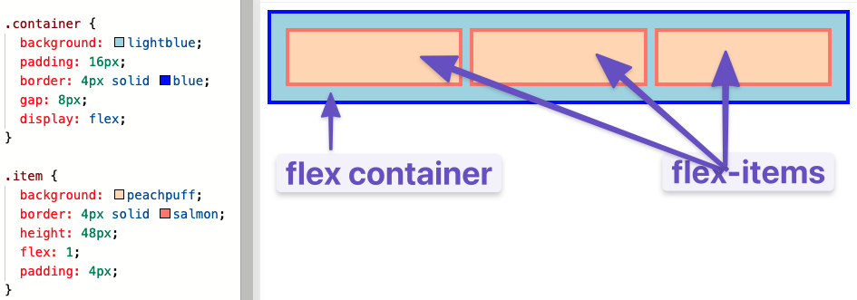
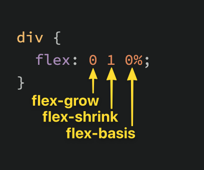

# Flexbox

**Flex container és flex Itemek** - Egy flex container egy bármilyen elem melynek CSS értéke  {display: flex;}. A flex item egy olyan elem amit egy flex container tartlamaz.

Egy elem lehet egyszerre flex container és flex item. Azaz egy flex itemen használhatunk egy display: flex-et és flexboxxal elrendezhessuk annak children elemeit. 

Flex containerek és itemek nestelésével fogunk a továbbiakban dolgozni. 

**flex** - A flex tulajdonság valójában 3 tulajdonság egybefoglalása. Ezek a tulajdonságok határozzák meg az itemek nagyságát a containeren belul. A flex a **flex-grow, flex-shrink, flex-basis** egybefoglalása
Alapértékek:

+ **flex-grow** - Egy számot kér feltételnek ami az item "novekedési faktorát" határozza meg. Ha az osszes item flex értéke 1 az azt jelenti hogy a containeren beluli itemek ugyanugy novekedjenek. Ha csak egy itemnek adunk meg pl. 2-es értéket az akkor 2x nagyobb lesz a tobbi itemnél. 
+ **flex-shrink** - Az item csokkenési faktorát határozza meg. Csak akkor lesz érvényes ha az osszes flex item egyben nagyobb mint a container. Az 1-es alapérték azt jelenti, hogy az itemek azonosan mennek ossze. Ha azt akarjuk, hogy az elemek nem menjenek ossze akkor ahhoz a 0-as értéket használjuk. 
+ **flex-basis** - A flex item kezdeti méretét határozza meg. Alapérték 0%, az auto érték esetén pedig a width érték alapján lesz megadva az alapérték.

## Flex direction

A flexbox mukdohet fuggolegesen vagy vizszintesen. Az alapérték a vizszintes azaz **row** a fuggoleges pedig a **column**. 

**Tengelyek** - 2 tengely létezik a fo tengely vagy a kereszt tengely. a row a main tengelyt jobbrol balra teszi a column pedig fentrol lentre. 

Ha a tengely column-ra van állitva akkor a flex-basis nél az auto a height alapján lesz beállátva. 

A flex: 1 tehát az itemeket ugy noveszti vagy zsugorítsa lejjebb hogy egyenloen toltsek be az elerheto helyet. A flex igazán alkalmas olyan itemek elrendezéséhez melynek megadott értéke van. 

**justify-content** - A main axis alapján álllítja be az itemeket. Értékei:
  + flex-start - Az axis elejétol
  + flex-end - Az axis végétol
  + center - Az axis kozepetol. 
  + space-between - A szabad helyet egyenloen elsosztja az itemek kozott.
  + space-around - Osszes item jobb- és bal oldalán azonos szabad hely. 
 
Az **align-items** pedig a kereszttengely alapján állítja be az itemeket. A flex-start értékkel az itemek a container tetején kezdodnek, flex-end - el a annak alján míg center-el a container kereszttengely kozepén. Align-items flex értékeI: flex-start, flex-end, center, stretch, baseline

Ha a flex-container flex-directionját átállítjuk columnra akkor a justify-content és align-items viselkedese ellentetes lesz. 

**gap** - Marginhoz hasonloan itt a container itemei kozott hagy helyet.

**flex-wrap:wrap** - Ha az itemek nem férnek el egy sorban akkor tobb sorba lesznek csomagolva. Alapértéke a nowrap. A flex direction és wrap osszetett parancsa a **flex-flow**

Ha a display: flex Akkor az itemek olyan magasak lesznek mint a legmagasabb item a containeren belul. 

**align-self** - Egy container item beállítása

Ha a container flex-direction értéke row a fo axis vízszintesen mozog és a kereszttengely a  az itemeket fel és le mozgatja

Ha a flex-direction column akkor az align items es align self az itemeket fel és le állítja

 

**align-content** - A sorok kozti helyet osztja szet. Ahhoz hogy ez mukodjon a containernek magasabbnak kell lennie mint az itemeknek. Értékei:
  + align-content: flex-start
  + align-content: flex-end
  + align-content: center
  + align-content: space-between
  + align-content: space-around
  + align-content: stretch
  + align-content: space-evenly (not defined in the Flexbox specification)

